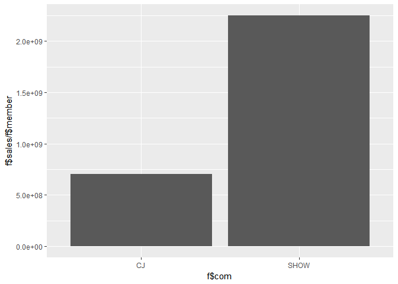

개인보고서\_60161219\_김은경
================

1.요약

1.1 배급사의 규모를 알기 위해 가장 많이 영화를 배급한 순서 10개의 매출액, 사원 수, 업력을 알아본다. 또한 가장 적게 영화를 배급한 순서 10개의 업력을 알아본 뒤, 그 두 개의 평균을 비교한다.

1.2 흥행영화와 배급사의 관계를 알기 위해 전체매출액이 높고 스크린 수가 많은 영화 10개의 배급사를 알아본다. 해당하는 배급사의 매출액, 평균연봉을 비교하고 이상치가 있는 경우 그것에 대한 분석을 실행한다.

결론 : 1.상위 10위의 배급사가 평균적으로 업력이 하위보다 높다. (약 2배) 2.상위 10위의 배급사는 평균연봉이 일반기업보다 높다. 3.전체 매출액에서 우위를 점하는 배급사는 CJ E&M이다. 4.전체 스크린 수에서 우위를 점하는 배급사는 (주)쇼박스이다. 5.두 배급사를 비교해보면 (주)쇼박스가 인원 수에 비해 매출액이 크다.

2.분석주제

영화가 상영되기 위해서는 배급사가 필수적이다. 하지만 흥행하는 영화, 즉 매출액이 높은 영화들은 몇몇 개의 배급사로 정해져 있다. 이는 배급사 독점현상이라 볼 수 있는데, 스크린을 독점하는 배급사들은 도대체 어떤 기업들인지 궁금해졌다. 따라서 각각 배급사에 대한 정보를 수집한 후, 이를 분석한다.

3.데이터선정

3.1 전체매출액과 배급사의 관계성 3.2 전국 스크린 수와 배급사의 관계성 3.3 06년도~16년도 배급사의 수 3.4 배급사의 규모(매출액, 평균연봉, 직원 수, 업력)

3.1과 3.2 3.3의 데이터는 영화진흥위원회 db 검색 영화 부분을 이용 3.4는 영화진흥위원회 db 검색 영화사 부분, 크레딧잡, 사람인 채용사이트, 오픈고(opengo)를 이용하였다. 매출액은 2016년 기준, 평균연봉 또한 2016년 국민연금의 데이터를 기준으로 하였다.

4.분석

06년도에서 16년도까지 영화 배급사의 비중을 측정하기 위해 어떤 배급사가 얼마나 많이 영화를 배급하였는지 살펴본다.

``` r
library(dplyr)
```

    ## Warning: package 'dplyr' was built under R version 3.4.2

    ## 
    ## Attaching package: 'dplyr'

    ## The following objects are masked from 'package:stats':
    ## 
    ##     filter, lag

    ## The following objects are masked from 'package:base':
    ## 
    ##     intersect, setdiff, setequal, union

``` r
load("moviehit.rda")
```

``` r
#상위 10개
mhit2 <- mhit %>% 
  group_by(mhit$배급사) %>%
  summarise(count = n()) %>%
  arrange(desc(count)) %>%
  head(10)

mhit2
```

    ## # A tibble: 10 x 2
    ##                      `mhit$배급사` count
    ##                              <chr> <int>
    ##  1      롯데쇼핑㈜롯데엔터테인먼트   128
    ##  2              씨제이엔터테인먼트   111
    ##  3                      (주)쇼박스   108
    ##  4                  (주)케이알씨지   102
    ##  5                씨제이이앤엠(주)   101
    ##  6                    ㈜인디스토리    75
    ##  7 (주)넥스트엔터테인먼트월드(NEW)    64
    ##  8            (주)씨타마운틴픽쳐스    62
    ##  9            골든타이드픽처스(주)    44
    ## 10                (주)시네마서비스    34

``` r
#하위 10개
mhit3 <- mhit %>%
  group_by(mhit$배급사) %>%
  summarise(count = n()) %>%
  arrange(count) %>%
  head(10)

mhit3
```

    ## # A tibble: 10 x 2
    ##                                               `mhit$배급사` count
    ##                                                       <chr> <int>
    ##  1                             (사)필레마,필름포럼,홀리가든     1
    ##  2                                             (유)쏘아필름     1
    ##  3                                 (유)씨에이치엔터테인먼트     1
    ##  4                                        (유)영화사 화수분     1
    ##  5                              (재)CBS,(주)영화사 안다미로     1
    ##  6                                      (주) 루스이소니도스     1
    ##  7                                    (주)H.F.G엔터테인먼트     1
    ##  8                                               (주)KW비젼     1
    ##  9                                         (주)갑종무비필름     1
    ## 10 (주)넥스트엔터테인먼트월드(NEW),(주)에스비에스콘텐츠허브     1

해당 배급사에 대한 정보를 수집한다. 다만, 10위까지의 배급사 중 정보가 없는 배급사가 각각 2개가 있어 12위까지 살펴보게 되었다. (씨제이엔터테인먼트는 CJ E&M에 합병되어 NA값으로 처리했다.)

``` r
mhit2 <- mhit %>% 
  group_by(mhit$배급사) %>%
  summarise(count = n()) %>%
  arrange(desc(count)) %>%
  head(12)

mhit3 <- mhit %>%
  group_by(mhit$배급사) %>%
  summarise(count = n()) %>%
  arrange(count) %>%
  head(12)

load("top.rda")
load("topl.rda")
top_10
```

    ## # A tibble: 12 x 5
    ##                      배급사명       연매출 평균연봉 직원수  업력
    ##                         <chr>        <dbl>    <dbl>  <dbl> <dbl>
    ##  1 롯데쇼핑㈜롯데엔터테인먼트           NA 21120000   4089    18
    ##  2                     CJ E&M 1.290532e+12 51650000   1832     7
    ##  3                   ㈜쇼박스 1.259000e+11 48120000     56    18
    ##  4               ㈜케이알씨지           NA 45430000      8     7
    ##  5                     CJ E&M           NA       NA     NA    NA
    ##  6                 인디스토리           NA 22370000      5    14
    ##  7     넥스트엔터테인먼트월드 1.039000e+11 38670000     68     9
    ##  8          씨타마운틴 픽쳐스           NA       NA     NA    NA
    ##  9          골든타이드 픽쳐스           NA 51430000      5     5
    ## 10               시네마서비스 1.000000e+09 52280000      4    13
    ## 11                영화사 진진           NA 36190000      8    11
    ## 12              소나무 픽쳐스           NA 33920000      6     6

``` r
top_10_l
```

    ## # A tibble: 12 x 5
    ##                                       배급사명  X__1  X__2 사원수  업력
    ##                                          <chr> <lgl> <lgl>  <dbl> <dbl>
    ##  1                                    필름포럼    NA    NA     NA     3
    ##  2                                    쏘아필름    NA    NA     NA     2
    ##  3                        씨에이치엔터테인먼트    NA    NA     NA     3
    ##  4                               영화사 화수분    NA    NA     NA     4
    ##  5                                    안다미로    NA    NA     NA     2
    ##  6                              루스이소니도스    NA    NA     NA     9
    ##  7                             HFG엔터테인먼트    NA    NA     NA    NA
    ##  8                                      KW비전    NA    NA     NA    NA
    ##  9                                갑종무비필름    NA    NA     NA     8
    ## 10 넥스트엔터테인먼트월드,에스비에스콘텐츠허브    NA    NA     NA     8
    ## 11                                  노리픽쳐스    NA    NA     NA    12
    ## 12          대명문화공장, 나이너스엔터테인먼트    NA    NA     12    NA

결측치를 제거한 후, 상위 10위까지의 업력을 조사한다.

``` r
is.na(top_10)
```

    ##       배급사명 연매출 평균연봉 직원수  업력
    ##  [1,]    FALSE   TRUE    FALSE  FALSE FALSE
    ##  [2,]    FALSE  FALSE    FALSE  FALSE FALSE
    ##  [3,]    FALSE  FALSE    FALSE  FALSE FALSE
    ##  [4,]    FALSE   TRUE    FALSE  FALSE FALSE
    ##  [5,]    FALSE   TRUE     TRUE   TRUE  TRUE
    ##  [6,]    FALSE   TRUE    FALSE  FALSE FALSE
    ##  [7,]    FALSE  FALSE    FALSE  FALSE FALSE
    ##  [8,]    FALSE   TRUE     TRUE   TRUE  TRUE
    ##  [9,]    FALSE   TRUE    FALSE  FALSE FALSE
    ## [10,]    FALSE  FALSE    FALSE  FALSE FALSE
    ## [11,]    FALSE   TRUE    FALSE  FALSE FALSE
    ## [12,]    FALSE   TRUE    FALSE  FALSE FALSE

``` r
mean(top_10$업력, na.rm = T)
```

    ## [1] 10.8

하위 10위의 평균 업력을 조사한다.

``` r
mean(top_10_l$업력, na.rm = T)
```

    ## [1] 5.666667

상위 10위와 하위 10위의 업력을 비교한다.

``` r
a <- data.frame(mean(top_10$업력, na.rm = T),
                mean(top_10_l$업력, na.rm = T))
a
```

    ##   mean.top_10.업력..na.rm...T. mean.top_10_l.업력..na.rm...T.
    ## 1                         10.8                       5.666667

즉, 영화를 더 많이 배급한 배급사일 수록 업력이 높다.

또한 상위 10위의 평균연봉과 2016년 대졸 전체평균초봉(3228만원)을 비교하였다.

``` r
b <- mean(top_10$연매출, na.rm = T)
c <- ifelse(b>32280000, "good", "bad")
c
```

    ## [1] "good"

즉, 상위 10위 기업들은 평균연봉이 전체평균보다 높다는 것을 알 수 있다.

다음은 흥행영화와 배급사의 관계이다. 우선 전국매출액이 높은 영화 10개를 나열한다.

``` r
mhit$전국매출액 <- ifelse(mhit$전국매출액 == 0, NA, mhit$전국매출액)
table(is.na(mhit$전국매출액))
```

    ## 
    ## FALSE  TRUE 
    ##  1687   225

``` r
d <- mhit %>% 
  filter(!is.na(mhit$전국매출액)) %>%
  head(10)
d
```

    ## # A tibble: 10 x 18
    ##     순번             영화명   감독                                제작사
    ##    <dbl>              <chr>  <chr>                                 <chr>
    ##  1     1               명량 김한민                      (주)빅스톤픽쳐스
    ##  2     2           국제시장 윤제균     (주)제이케이필름,씨제이이앤엠(주)
    ##  3     3             베테랑 류승완                          (주)외유내강
    ##  4     5             도둑들 최동훈                        (주)케이퍼필름
    ##  5     6       7번방의 선물 이환경     (주)화인웍스,(주)씨엘엔터테인먼트
    ##  6     7               암살 최동훈                        (주)케이퍼필름
    ##  7     8 광해, 왕이 된 남자 추창민 리얼라이즈픽쳐스(주),씨제이이앤엠(주)
    ##  8     9             부산행 연상호                    (주)영화사레드피터
    ##  9    11             해운대 윤제균                      (주)제이케이필름
    ## 10    12             변호인 양우석                        위더스필름(주)
    ## # ... with 14 more variables: 수입사 <chr>, 배급사 <chr>, 개봉일 <chr>,
    ## #   영화유형 <chr>, 영화형태 <chr>, 국적 <chr>, 전국스크린수 <dbl>,
    ## #   전국매출액 <chr>, 전국관객수 <dbl>, 서울매출액 <chr>,
    ## #   서울관객수 <dbl>, 장르 <chr>, 등급 <chr>, 영화구분 <chr>

배급사의 수를 세어 많은 순으로 나열한다.

``` r
d %>%
  group_by(d$배급사) %>%
  summarise(count = n()) %>%
  arrange(desc(count))
```

    ## # A tibble: 4 x 2
    ##                        `d$배급사` count
    ##                             <chr> <int>
    ## 1                씨제이이앤엠(주)     4
    ## 2 (주)넥스트엔터테인먼트월드(NEW)     3
    ## 3                      (주)쇼박스     2
    ## 4              씨제이엔터테인먼트     1

씨제이엔터테인먼트는 씨에이이앤엠(이하 CJ E&M)으로 합병되었다. 따라서 매출액 상위 10위 중 가장 많은 비중을 차지하는 배급사는 CJ E&M이다.

스크린 수 또한 비교해보았다.

``` r
e <- mhit %>% 
  arrange(desc(mhit$전국스크린수)) %>%
  head(10)
e
```

    ## # A tibble: 10 x 18
    ##     순번            영화명   감독
    ##    <dbl>             <chr>  <chr>
    ##  1    13          검사외전 이일형
    ##  2     9            부산행 연상호
    ##  3     1              명량 김한민
    ##  4     7              암살 최동훈
    ##  5    51            마스터 조의석
    ##  6    32              곡성 나홍진
    ##  7    22              밀정 김지운
    ##  8    55 군도: 민란의 시대 윤종빈
    ##  9    31 은밀하게 위대하게 장철수
    ## 10   111            아수라 김성수
    ## # ... with 15 more variables: 제작사 <chr>, 수입사 <chr>, 배급사 <chr>,
    ## #   개봉일 <chr>, 영화유형 <chr>, 영화형태 <chr>, 국적 <chr>,
    ## #   전국스크린수 <dbl>, 전국매출액 <chr>, 전국관객수 <dbl>,
    ## #   서울매출액 <chr>, 서울관객수 <dbl>, 장르 <chr>, 등급 <chr>,
    ## #   영화구분 <chr>

``` r
e %>%
  group_by(e$배급사) %>%
  summarise(count = n()) %>%
  arrange(desc(count))
```

    ## # A tibble: 5 x 2
    ##                        `e$배급사` count
    ##                             <chr> <int>
    ## 1                      (주)쇼박스     4
    ## 2                씨제이이앤엠(주)     3
    ## 3 (주)넥스트엔터테인먼트월드(NEW)     1
    ## 4         워너브러더스 코리아(주)     1
    ## 5          이십세기폭스코리아(주)     1

스크린 수에서 가장 많은 비중을 차지한 것은 (주)쇼박스였다.

즉, 영화의 흥행기준을 매출액으로 본다면 CJ E&M, 스크린 수가 많은 것으로 본다면 (주)쇼박스가 우위를 차지한다.

그렇다면 CJ E&M과 (주)쇼박스의 비교를 해보자.

단순히 매출액만 비교해본다면,

``` r
library(ggplot2)
```

    ## Warning: package 'ggplot2' was built under R version 3.4.2

``` r
f <- data.frame(com = c("CJ","SHOW"),
                sales = c(1.290532e+12,1.259000e+11),
                salary = c(51650000,48120000),
                member = c(1832,56),
                year = c(7,18))
ggplot(data = f, aes( x = f$com, y = f$sales)) + geom_col()
```


하지만 1인당 매출액 비교시에는 이런 값이 나온다.

``` r
ggplot(data = f, aes( x = f$com, y = f$sales/f$member)) + geom_col()
```



평균연봉을 인원 수만큼 나눠서 비교해 볼때는 이런 값이 나온다.

``` r
ggplot(data = f, aes( x = f$com, y = f$salary/f$member)) + geom_col()
```


즉, (주)쇼박스가 CJ E&M보다 매출액과 연봉이 높다는 것을 알 수 있었다.

5.논의

한계점

이번 분석에서는 흥행영화의 기준을 매출액이 높은 영화, 스크린 수가 많은 영화로 두었지만 실제로는 인지도, 개봉시기 등 수많은 변수가 영향을 준다. 따라서 매출액과 스크린 수만 가지고 흥행을 판단할 수 없는 한계점이 있다. 또한, 영화진흥위원회의 공식통계를 바탕으로 분석을 진행하였지만, 다른 사이트(사람인, 크레딧 잡 등)에서 모은 정보는 공식통계가 아니기에 직원 수나 매출부분 등이 다를 가능성이 있다. 마지막으로 06년도에서 16년도까지의 영화를 바탕으로 했기에, 전체 영화에서 배급사가 차지하는 부분을 조사하기에는 데이터의 양이 적었다. 배급사의 규모를 알아보는 점에서도 데이터가 별로 없었다. 따라서 원래의 목적은 상위 10개의 배급사와 하위 10개의 배급사 전부의 매출액과 연봉, 직원 수 모두를 조사하는 것이었지만 업력으로 대체하였다.

비판점

공동배급에 대해서 신경 쓰지 못했다. 데이터 분석에서도 (주)넥스트엔터테인먼트월드는 매출액, 스크린 수, 배급영화 수에서도 상위권에 들었지만, SBS 콘텐츠 허브와의 공동배급으로 하위 10위에 들었다. 또한, 영화진흥위원회의 공식통계를 바탕으로 하긴 했지만, 다른 사이트(사람인, 크레딧잡 등)에서 모은 정보는 공식통계가 아니기에 직원 수나 매출 부분이 다를 가능성이 있다.

추가 분석

배급 영화 순으로 나열한 것 중, 데이터가 없어 분석하지 못한 배급사 씨타마운틴 픽쳐스에 대한 추가분석과, 기업의 규모에 대해 더 많은 변수로 추가분석을 진행하면 좋겠다는 생각이 들었다. 특히나 데이터가 없어 분석하지 못했던 주제인, 영화 배급을 많이 하면 기업 매출액이 높을지의 여부를 조사하고 싶다.
